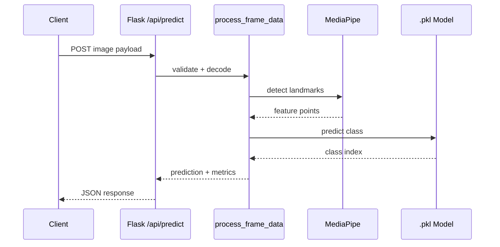

# API Reference

This project exposes a direct prediction API alongside the browser UI.

## Request-Response Flow

### Element Guide

- `Client`: Caller script, service, or frontend sending image input.
- `Flask /api/predict`: API route that validates payload and formats output.
- `process_frame_data`: Shared inference logic used by UI and API.
- `MediaPipe`: Hand-landmark detection stage.
- `.pkl Model`: Trained classifier artifact used for final class prediction.

## Predict

`POST /api/predict`

Use this endpoint when you want to send a single image and get a prediction back without using the webpage.

### Supported Inputs

- `multipart/form-data` with file field `image`
- `application/json` with base64 content in `image_base64`

### Optional Fields

- `show_landmarks`: `true` or `false`
- `include_visuals`: `true` or `false`

### Response Fields

- `prediction`: predicted class label
- `brightness`: frame brightness score
- `contrast`: frame contrast score
- `low_brightness`: whether the image is below the configured threshold
- `model`: active model filename

When `include_visuals` is enabled, the response also includes:

- `processed_frame`
- `original_frame` when landmarks are hidden

### Notes

- The endpoint reuses the same inference pipeline as the web UI.
- The webpage stays available at the same time, so both flows can be used together.
