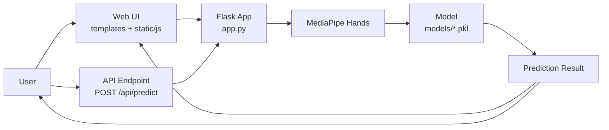
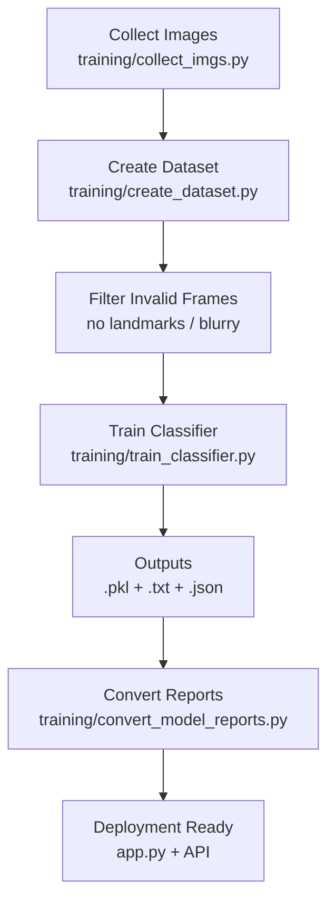
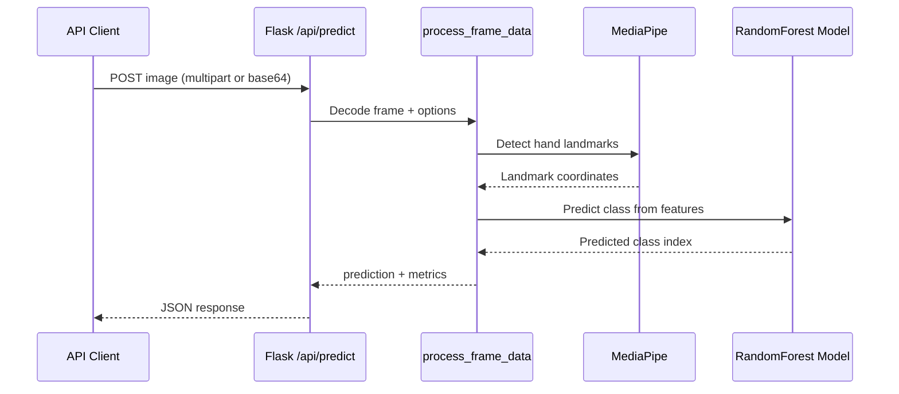
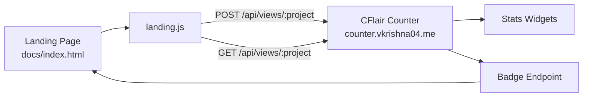

# Architecture and Flow Charts

This document provides visual Mermaid charts for the main project flows.
Each chart is followed by an element-by-element explanation.

## 1) System Overview

### Element Guide

- `User`: Person using browser UI or sending direct API requests.
- `Web UI`: Frontend pages and JavaScript that capture frames and render outputs.
- `Flask App`: Main backend that coordinates frame decoding, feature extraction, and prediction.
- `API Endpoint`: Programmatic interface for single-image inference without webpage usage.
- `MediaPipe Hands`: Landmark detector used to generate structured hand features.
- `Model`: Trained classifier stored as `.pkl` files in `models/`.
- `Prediction Result`: Final class output and optional quality metrics returned to UI/API caller.

## 2) Training Pipeline

### Element Guide

- `Collect Images`: Captures class-wise sign images into `data/` folders.
- `Create Dataset`: Converts images into normalized landmark features.
- `Filter Invalid Frames`: Drops poor samples to improve downstream model quality.
- `Train Classifier`: Builds the RandomForest model from feature dataset.
- `Outputs`: Produces model artifact and model-quality reports.
- `Convert Reports`: Converts/normalizes report formats for sidebar and analytics consumption.
- `Deployment Ready`: Makes trained model usable in web and API inference flows.

## 3) API Inference Sequence

### Element Guide

- `API Client`: External app/script calling `/api/predict`.
- `Flask /api/predict`: Request validator and response formatter.
- `process_frame_data`: Shared inference function used by both UI and API paths.
- `MediaPipe`: Produces landmark tensors from incoming image frame.
- `RandomForest Model`: Converts landmark feature vector into class prediction.

## 4) Telemetry and Stats Flow

### Element Guide

- `Landing Page`: Public docs homepage hosted on GitHub Pages.
- `landing.js`: Client script that increments and fetches project views.
- `CFlair Counter`: External telemetry service used for anonymous count metrics.
- `Badge Endpoint`: Embeddable counter badge image endpoint.
- `Stats Widgets`: On-page values showing views and health state.
