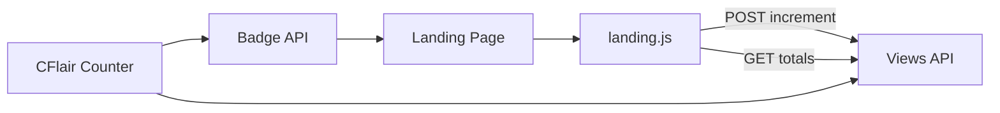

# Telemetry Integration

This project integrates with [CFlair-Counter](https://github.com/Life-Experimentalist/CFlair-Counter?tab=readme-ov-file#cflair-counter) to track anonymous project usage and show project stats.

## Telemetry Flow



### Element Guide

- `Landing Page`: GitHub Pages site where counters are shown.
- `landing.js`: Client-side telemetry script.
- `CFlair Counter`: Counter backend service.
- `Views API`: Endpoint group used for increment and retrieval.
- `Badge API`: Endpoint used for embeddable view badge image.

See also [Integration Guide](INTEGRATION.md) for the quick API reference and implementation checklist.

## Counter Service

- Base URL: `https://counter.vkrishna04.me`
- Increment endpoint: `POST /api/views/:projectName`
- Badge endpoint: `GET /api/views/:projectName/badge`

## How It Works

- A lightweight client-side request is sent on page load to increment the counter.
- No app features depend on telemetry.
- If telemetry fails or is blocked, app behavior is unchanged.

## Environment Variables

Set these in `.env` to control telemetry behavior:

- `DISABLE_ANONYMOUS_TELEMETRY` (preferred) or `DISABLE_ANONYMOUS_TELMETRY` (legacy typo compatibility)
- `TELEMETRY_COUNTER_BASE_URL` (default: `https://counter.vkrishna04.me`)
- `TELEMETRY_PROJECT_NAME` (default: `sign-language-detector`)

Example:

```env
DISABLE_ANONYMOUS_TELMETRY=true
TELEMETRY_COUNTER_BASE_URL=https://counter.vkrishna04.me
TELEMETRY_PROJECT_NAME=sign-language-detector
```

## Badge Example

```markdown

```
